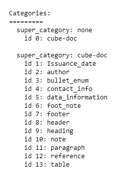
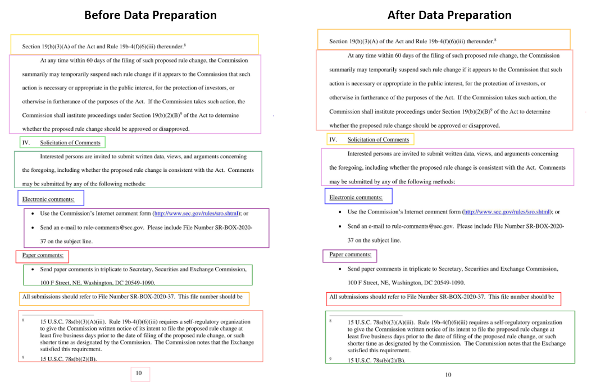
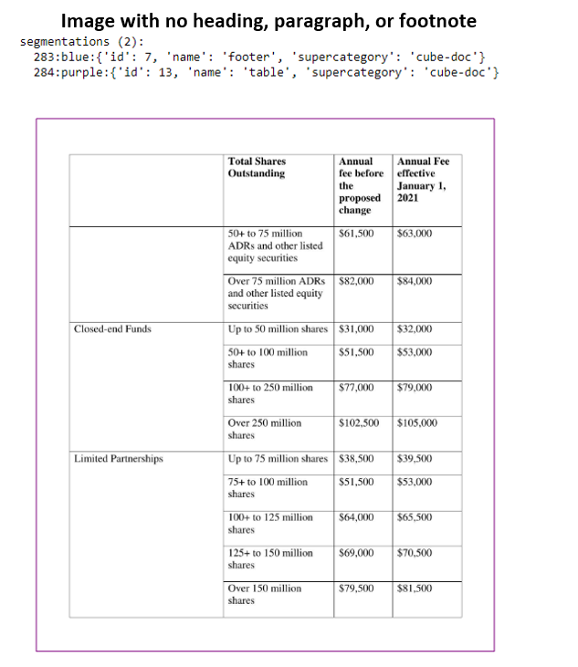
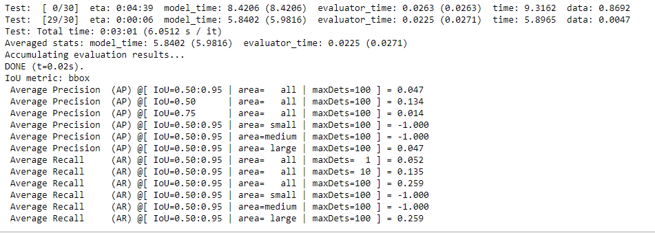

# RegTransform Challenge

## Objective

* This repo contaims the resource files used to address the [RegTransform take-home challenge](https://chrome-alphabet-530.notion.site/Capture-AI-RegTransform-Take-home-Challenge-71df4f9ff61243c9985db0e990b20a02#941c4129ea87417a820041977645d693).

## Methodology

* The [CRISP-DM](https://www.ibm.com/docs/en/spss-modeler/saas?topic=dm-crisp-help-overview) methodology has been used to work on the challenge.

## Working Time

* Total Working Time: 8 Hours.

    * Research & Review of Related Work: 1 Hour.

    * Code Development & Testing: 4 Hours.

    * Code Execution & Processing: 2 Hours.

    * Documentation: 1 Hour.

## Business Understanding

* This [section](https://chrome-alphabet-530.notion.site/Capture-AI-RegTransform-Take-home-Challenge-71df4f9ff61243c9985db0e990b20a02#f7459fc1af3645bda954906d551da344) has a summary of the business areas that are relevant to the challenege. RegBook is a main product by CUBE which allows our users to manage their inventory of relevant regulations.

* RegBook can also provide interesting signals about regulatory change before it happens. 

* For this to happen, a core pre-requisite is to extract content from the documents. As the document structure varies widely, computer vision is the go to technique to extract content out of the RegBook images. 

* The objective of the challenege is to build a Deep Learning model to solve this problem, focusing on three classes: headings, paragraphs and footnotes from the images.

## Data Understanding

* The challenege has provided 301 document images annotated with the [COCO format](https://towardsdatascience.com/getting-started-with-coco-dataset-82def99fa0b8). 

* These images have already been divided into train, test, and validate groups.

* To better understand the data, the [COCO_Image_Viewer](https://github.com/anammari/regtransform_challenge/blob/main/exlploration/COCO_Image_Viewer.ipynb) Jupyter Notebook has been created to explore the images and associated COCO meta-data.

* Data exploration shows that there are 13 classes:

## Data Preparation

* Since the challenege requires the focus on three target classes only (headings, paragraphs, footnotes), a data preparation script, [select_anno_from_coco.py](https://github.com/anammari/regtransform_challenge/blob/main/preparation/select_anno_from_coco.py), has been created to limit the categories and annotations of the training and validation data to those related to these target classes, as depicted in the example below:

* A data preparation script, [detect_faulty_anno_from_coco.py](https://github.com/anammari/regtransform_challenge/blob/main/preparation/detect_faulty_anno_from_coco.py), has been created to detect *faulty* image(s) in the training dataset. Faulty images are those which do not have any valid labels to make it eligble to be used for object detection model training, as depicted in the example below:

## Modelling

* The following scripts have been created to train and evaluate the Deep Learning model:

    * [main.py](https://github.com/anammari/regtransform_challenge/blob/main/modelling/main.py): Main script for model training and evaluation.

    * [util.py](https://github.com/anammari/regtransform_challenge/blob/main/modelling/util.py): Utility script for creating custom datasets for training and testing and other helper and utility functions

    * [config.py](https://github.com/anammari/regtransform_challenge/blob/main/modelling/config.py): Configuration script for storing paths to datasets and COCO files and model paraneters.

    * [External](https://github.com/anammari/regtransform_challenge/tree/main/external) utility and helper functions downloaded from the [Torchvision repo](https://github.com/pytorch/vision/tree/main/references/detection).

    * [Run_Main](https://github.com/anammari/regtransform_challenge/blob/main/modelling/Run_Main.ipynb): Jupyter Notebook used to run the model training, evaluation, and persistence logic to save & explore the processing logs.

* Object Detection Algorithm Selected: The [Faster RCNN](https://blog.francium.tech/object-detection-with-faster-rcnn-bc2e4295bf49) Algorithm implemented in PyTorch.

* Number of Epochs: 1 (originally 6; has been set to 1 to save processing time given the assessment time limitation).

## Evaluation

* The model has been evaluated against the Images in the validation subset. 

* Precision and Recall are the main Evaluation Criteria. 

## Deployment

* Due to time limitation of the assessment, deployment has been limited to persisting the model and testing the model against a few images from the testing dataset.

* Persisted model weights have been saved to the models folder. However due to GitHub file size limitation (< 100MB), model weights have not been pushed to this repo.

* The [COCO_Inference](https://github.com/anammari/regtransform_challenge/blob/main/exlploration/COCO_Inference.ipynb) Jupyter Notebook has been created to produce model predictions and explore detected classes in testing COCO image sample. 

## Future Work

* Due to time limitation of the assessment, the following subtasks have not been implemented:

    * Improving the performance of the object detection model. This [blog post](https://blog.francium.tech/improve-the-performance-of-your-object-detection-model-af6a20319f56) presents a few promising techniques to try.

    * Textual content extraction (OCR Model) from the document detected regions (headings, paragraphs, footnotes).

    * Textual content persistence / archiving into JSON output files.

## References

* [Capture AI - RegTransform Take-home Challenge](https://chrome-alphabet-530.notion.site/Capture-AI-RegTransform-Take-home-Challenge-71df4f9ff61243c9985db0e990b20a02#f7459fc1af3645bda954906d551da344)

* [Getting started with COCO dataset](https://towardsdatascience.com/getting-started-with-coco-dataset-82def99fa0b8)

* [How to train an Object Detector with your own COCO dataset in PyTorch](https://medium.com/fullstackai/how-to-train-an-object-detector-with-your-own-coco-dataset-in-pytorch-319e7090da5)

* [Pytorch Starter - FasterRCNN Inference](https://www.kaggle.com/code/pestipeti/pytorch-starter-fasterrcnn-inference/notebook)